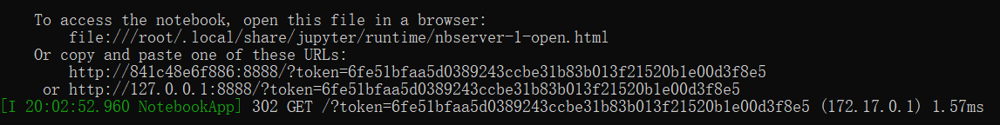

# ENSO_forecast

## Dataset
You can download the CNRM model data for training from [here](http://portal.nersc.gov/project/dasrepo/AMS_ML_Tutorial/CNRM_tas_Anomalies_regridded.nc). The instrument data for SST anomaly is [here](https://climate.mri-jma.go.jp/pub/ocean/cobe-sst2/) and the ground truth Nino 3.4 index can be downloaded from this [website](https://portal.nersc.gov/project/dasrepo/AGU_ML_Tutorial/nino34.long.anom.data.txt). This [website](https://cds.climate.copernicus.eu/cdsapp#!/home) provides many options for reforecasr data.

## CNN pre-trained models
We share our pre-trained CNN models for lead times from 1 to 9. Use this [link](https://drive.google.com/drive/folders/1LTysXR1-cZZXog1J20bplrkZa7Emiw4f?usp=sharing) to access to our Google drive.

## Usage
### Use Microsoft Windows 10 as the operating system. If you use iOS or other operating systems, adjust the commands accordingly.
- Clone this repo using Git Bash:
```bash
git clone https://github.com/DS-560/ENSO_forecast.git
```

If you have pretrained models and datasets, put them under directories "/checkpoints/" and "/datasets/", respectively. All the output CNN models will be saved under "/checkpoints/" and output results will be saved under "/results/".
### All the commands below are executed using [Anaconda Prompt](https://www.anaconda.com/) unless specified otherwise.
- Set the repository you just cloned as your working directory. The path to the directory may vary for different users. An example command is shown below:
```bash
cd "C://Users//your//name//ENSO_forecast"
```

- If you have <strong>venv</strong> installed, please skip. Use the following command to install  <strong>venv</strong>. This requires Python3.8 or above. Other visions may work, but we do not guarantee.
```bash
pip install --user virtualenv
```
- Create a virtual environment (named ENSO) and activate it:
```bash
python -m venv ENSO
.\ENSO\Scripts\activate
```
- Install Pytorch and other dependencies for the environment. Use the command below if your device has a GPU and CUDA10.2. Refer to the [instructions](https://pytorch.org/get-started/locally/) if your device has different configurations.
```bash
pip install torch===1.7.0 torchvision===0.8.1 torchaudio===0.7.0 -f https://download.pytorch.org/whl/torch_stable.html
pip install -r requirements.txt
```
- You can extract a dependency list:
 ```bash
pip freeze > requirements.txt
```
- To see the descriptions of parameters for training/testing/reforecasting, you can use help function to print the descriptions on screen. An example of printing descriptions for training is given below.
 ```bash
python train.py -h
```
### Training
- You must specify "dataroot", "name", "startdate", and "enddate", which refer to the path to the training dataset, the name of your CNN model, the training starting date, and the training end date in ISO format, respectively. An example command to train a CNN model with CNRM dataset is given below. The linear regression model will be trained in runtime when trying to do predictions. Edit "--epoch" to change the number of training epochs.
 ```bash
python train.py --dataroot "./datasets/CNRM_tas_anomalies_regridded.nc" --name test_cnn --startdate 1980-01-01 --enddate 2101-12-31   --dataset CNRM --num_input_time_steps 2 --epoch 5
```

### Testing
- Specify the four same required parameters as in training. At this time, the "--name" parameter refers to the path to a CNN model by which you want to preduce predictions. It is the name of the experiment for using linear regression. The "--test_start " and "--test_end " are the start and end dates in ISO format for prediction. Specify "--startdate" and "--enddate" as empty string for using CNN, but they should be the start and end training dates for using linear regression. The "dataroot" refers to the testing file for CNN and is the training file for linear regression. The "dataroot1" is the path to the testing file for linear regression and "instrument_data " is the path to the ground truth Nino3.4 index as a text file for using all models. An output text file containing the predictions and a plot will be saved under "./results/". The following command initiates a testing by using a pretrained model.
 ```bash
python test.py --dataroot "./datasets/sst.mon.mean.trefadj.anom.1880to2018.nc" --instrument_data "./datasets/nino34.long.anom.data.txt" --name NinoPrediction_leadtime1_timespan1850-01-01-2299-01-01.pt  --startdate "" --enddate ""  --test_start 2002-01-01 --test_end 2015-12-31 --dataset observations --compare_ground_truth --num_input_time_steps 2
```
- By default, the testing would not produce a result in comparison with ground truth. If "--compare_ground_truth" is not used, the resulting plot will only contains the model predictions and there is no need to specify ground truth Nino3.4 index as in "--instrument_data". The following code produces soley predictions using linear classification.
```bash
python test.py --dataroot "./datasets/CNRM_tas_anomalies_regridded.nc" --dataroot1  "./datasets/sst.mon.mean.trefadj.anom.1880to2018.nc" --dataset CNRM --name linear_classification --startdate 1950-01-01 --enddate 2050-12-31 --instrument_data "" --test_start 2002-01-01 --test_end 2015-12-31  --model linear_regression --classification 
```
### Reforecast
- Model predictions can be compared with theory-based model predictions if reforecast data for the past is available. The following command is to use predictions from a CNN pretrained model against reforecast data. Specify your reforecast data path and the year to which you want to extract in the "reforecast.txt" separated by a comma. In addition, this function is also able to provide visualization of model prediction compared to forecast data for the future. One can simply modify the input in "reforecast.txt" to use the correct forecast dataset and change "--dataroot" to use the correct dataset over which the ML model can make predictions for the future.
```bash
python reforecast.py --dataroot "./datasets/sst.mon.mean.trefadj.anom.1880to2018.nc" --instrument_data "./datasets/nino34.long.anom.data.txt" --name NinoPrediction_leadtime2_timespan1850-01-01-2299-01-01.pt  --startdate "" --enddate "" --test_start 1992-01-01 --test_end 2015-12-31   --dataset observations  --leadtime 2 --reforecast_data reforecast.txt --compare_ground_truth --num_input_time_steps 2
```
- You can also use linear classification model to test its ability against reforecast data.
```bash
python reforecast.py --dataroot "./datasets/CNRM_tas_anomalies_regridded.nc" --dataroot1  "./datasets/sst.mon.mean.trefadj.anom.1880to2018.nc" --instrument_data "./datasets/nino34.long.anom.data.txt" --dataset CNRM --name LR   --startdate 1950-01-01 --enddate 2050-12-31 --test_start 1992-01-01 --test_end 2015-12-31  --leadtime 2 --reforecast_data reforecast.txt --model linear_regression --compare_ground_truth --classification 
```

---

## Management tools
### Figshare
- Share research results
- Link to [figshare](https://figshare.com/projects/ENSO_Forecast/93302)

### Zenodo
- Make Github's work available for reference
- [](https://zenodo.org/badge/latestdoi/316078841)
 
## Docker
- We provide a dockerfile by which you can build your container. Refer to the instructions above to clone this repository and set up your datasets and models (if any). Please make sure you have installed [Docker Desktop](https://www.docker.com/products/docker-desktop) in your computer. Also, make sure that your docker daemon is running. In Anaconda Prompt, go to the repository you just cloned. An example command is as below.
 ```bash
cd "C://Users//your//name//ENSO_forecast"
```
- Run the following command to build your image named as "enso".
 ```bash
docker build --tag enso:1.0 .
```
- When the image has been successfully built, run the command below to serve your image.
 ```bash
docker run -p 8888:8888 -it enso:1.0
```
- When prompted to use the links, you can copy and paste one of the links into your browswer. Usually, the last link works. The links are randomly generated. Below is an example prompt that you will see after executing the command to serve the image. The example prompt contains three links.


- When you open the link in a new tab, click on "ENSO_forecast.ipynb" to access to the notebook where you can use the training/testing/reforecast commands above.

## Jupyter Notebook
- A Jupyter notebook named "ENSO_forecast.ipynb" is provided in this repository. Make sure you have installed [Jupyter Notebook](https://jupyter.org/index.html). If you have cloned this repository and followed the instructions above to set up your models (if any) and datasets, you can open your Anaconda Prompt. In Anaconda Prompt, go to the repository you just cloned. An example command is as below.
 ```bash
cd "C://Users//your//name//ENSO_forecast"
```
- Type the following command in your Anaconda Prompt to launch Jupyter.
 ```bash
jupyter notebook
```
- A new tab will be opened. Click on "ENSO_forecast.ipynb" to access to the notebook where you can use the training/testing/reforecast commands above.
